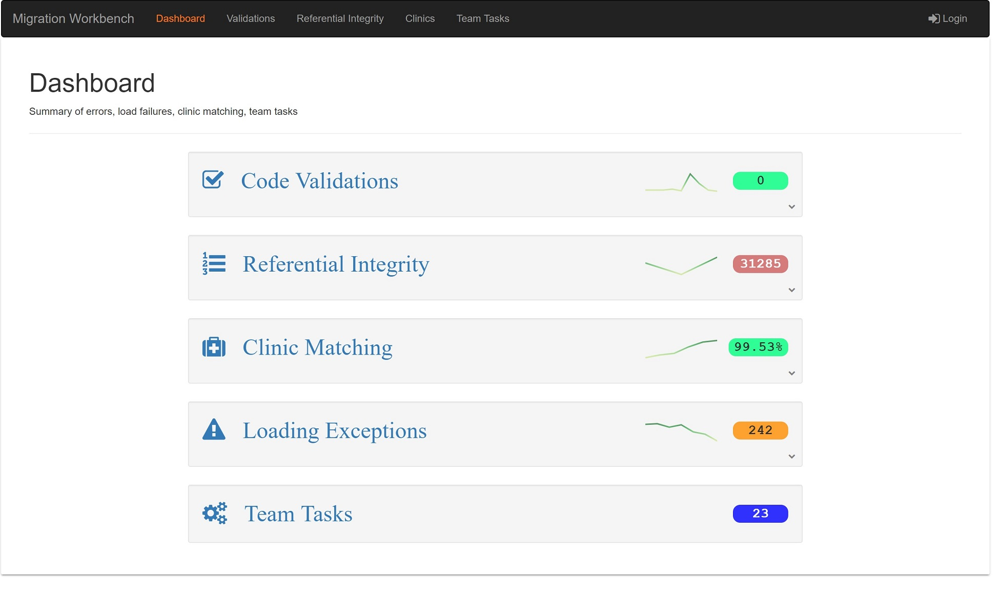

# Mwb-v2-Redux - Data Migration Workbench

## **Application Overview**

A web based app for reviewing progress and test results of a data migration project (Healthcare). Picks up test result files generated by LinqPad and displays a summary dashboard of key metrics.

There are three types of results, each handled by different teams in the project:  
&nbsp;&nbsp;&nbsp;&nbsp;**Validations** - check the validity of codes included in the migration data  
&nbsp;&nbsp;&nbsp;&nbsp;**Referentials** - check the referential integrity between records in the migration data  
&nbsp;&nbsp;&nbsp;&nbsp;**Clinics** - check the degree of correlation between Outpatient records in the migration data and configured clinics  

 

## **Feature list**

#### Dashboard

- compact summary information for each area of interest (measure)
- current error count or progress figure
- green/yellow/red color indicator
- sparkline trend indicator
- drop down narrative text (initially hidden), if text is configured
- animated panel opening for narrative text
- link to details page

#### Linqpad Test Result Details Pages  

- common layout and code for all three measure areas
- display latest test results
- previous tests can be selected from a side panel list
- text search across all loaded results

#### Results file list with list limiter  

- file list initially displays only most recent results (as configured for the measure)
- file list expands, when requested, to show older results
- file list shows ellipsis for tests on the same date (implicit grouping)
- narrow (custom) scrollbar

#### Search  

- search terms entered are reactively evaluated against the currently displayed test result
- matches in the current display are high-lighted in yellow
- evaluation is delayed with debounce of 400ms
- search indicator badge in the results header shows match count
- search button conducts global search in all loaded results
- global search displays modal of result files with match
- file-list shows indicator against files that match

#### Team Tasks  

- login required to access (authguard)
- kanban board display
- drag and drop tasks between categories

 

## **Architecture**

This app is built with Angular v5, bootstrap, angular-redux/store, and d3.  
Testing consists of unit tests, e2e tests via karma/protractor and also a suite of **Cypress.io** integration tests for comparison.

 

### **Documentation pages**  
  
- [Measure Calculation](./docs/measure-calculation.md)
- [DashboardThumbnail component](./docs/dashboard-thumbnail.md)
- [DashboardThumbnail Dropdown Panel](./docs/narrative-dropdown-panel.md)
- [Scrollbar CSS Adjustments](./docs/scrollbar-css-adjustments.md)
- [Redux Store](./docs/redux-store.md)
- [Redux Middleware](./docs/redux-middleware.md)
- [Redux Selector Helpers](./docs/redux-selectors - selector helpers.md)
- [Redux Selector Computed State](./docs/redux-selectors - computed state.md)
- [Redux Selector Processing Arrays](./docs/redux-selectors - processing with array flattening.md)
- [Redux Reducer Testing](./docs/redux-reducer-testing.md)
- [SearchComponent Testing Notes](./docs/search.component-tests.md)
- [Test Code Coverage](./docs/code-coverage.md)

 

## **How to use**

This project was generated with [Angular CLI](https://github.com/angular/angular-cli) version 1.6.8.

#### Demo

A demo of the application is hosted on Firebase at [Migration Workbench](https://migrationworkbench.firebaseapp.com)

#### Local installation  

Download from Github and run **yarn** to install npm dependencies.

#### Development server

Run `ng serve` for a dev server. Navigate to `http://localhost:4200/`. The app will automatically reload if you change any of the source files.

#### Build

Run `ng build` to build the project. The build artifacts will be stored in the `dist/` directory. Use the `-prod` flag for a production build.

#### Running unit tests

Run `ng test` to execute the unit tests via [Karma](https://karma-runner.github.io).

#### Running end-to-end tests

Run `ng e2e` to execute the end-to-end tests via [Protractor](http://www.protractortest.org/).

#### Running Cypress integration tests

The Cypress tests are packaged separately from the main application, because Cypress installs a lot of npm dependencies and adds considerable time to npm changes within the application itself.

To run Cypress tests,  

- run `ng serve` to serve the application from the local dev server.
- cd into the '/tests' sub-folder. This folder has it's own package.json with it's own scripts.
- run `npm run cypress:open` to start the Cypress test runner.
