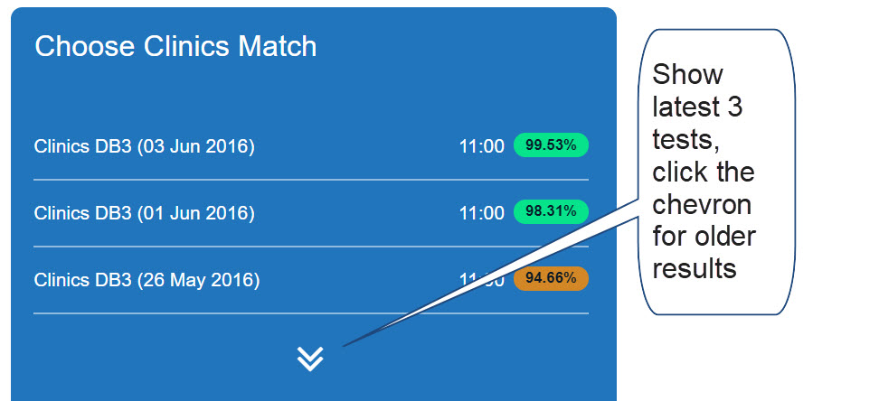
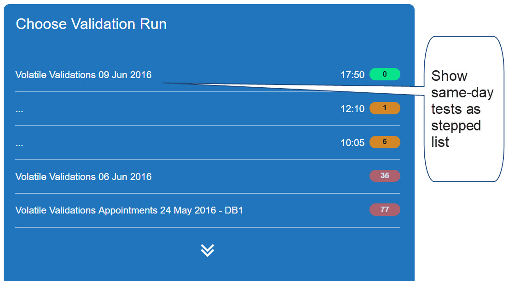

## Measure Calculation

### Features

The purpose of this application is to display HTML files created by Linqpad (see Application Overview).
To make it easier to monitor and manage progress, the following features are added:

- Dashboard display of metrics with color code and units  
  

- Sparkline showing the trend of recent tests  
  

- Focus on current working set (last few days) to reduce clutter  

- Stepping of daily test runs to highlight progress  

### Data parsing

Both the file names and the contents are parsed for data. The file name gives the test type and date/time info. The content gives the metric data.

The following data structures are created to support the features above.

- FileInfo object with test type, date, time, metric, color, units (for dashboard)
- Array of recent metric history (for sparkline)
- Sequence no attached to test to indicate re-run sets (for test grouping)

### Process steps

The `data.service` provides file processing, with the help of sub-services.

1. #### File list fetching (_file.service.ts_)

    Invokes http.get to fetch the file list, and handles pending flag and saving of the list to Reduc store.

2. #### File name parsing (_name-parsing.service.ts_)

    Converts each file name into a FileInfo object, separating out date, time and test type.

3. #### File sorting and sequencing (_list-formatter.service.ts_)

    Files are sorted by date, type and time. A sequence number is applied to files of the same date and type, to group repeat runs on the same day.

4. #### Content is fetched and metric extracted (_format.service.ts_ and derived classes)
    The file itself is read (with FileService) and the metric value is extracted in a sub-class of FormatService.

### DataService sub-classing

Each page has 90% identical data initialization, except for a few methods.  
Therefore, the bulk of the code is in an abstract base class **DataService** which has abstract methods for the parts that differ.
